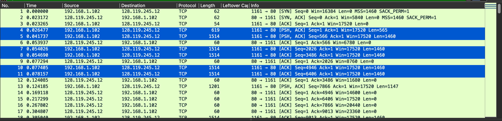

## 1. What is the IP address and TCP port number used by the client computer (source) that is transferring the file to gaia.cs.umass.edu?
 
>client的ip为192.168.1.102，tcp端口号为1161.

## 2. What is the IP address of gaia.cs.umass.edu? On what port number is it sending and receiving TCP segments for this connection?

>gaia.cs.umass.edu的ip地址为128.119.245.152，tcp端口号为80

 

截图来自tcp-ethereal-trace-1

## 3. What is the IP address and TCP port number used by your client computer (source) to transfer the file to gaia.cs.umass.edu?
>在自己的trace当中client的ip为192.168.1.101，tcp端口号为60692.

截图来自自己的trace文件alice_catch.pcapng

## 4. What is the sequence number of the TCP SYN segment that is used to initiate the TCP connection between the client computer and gaia.cs.umass.edu? What is it in the segment that identifies the segment as a SYN segment?
>sequence number为0，segment中的flag标记出了SYN segment

截图来自自己的trace文件alice_catch.pcapng

## 5. What is the sequence number of the SYNACK segment sent by gaia.cs.umass.edu to the client computer in reply to the SYN? What is the value of the Acknowledgement field in the SYNACK segment? How did gaia.cs.umass.edu determine that value? What is it in the segment that identifies the segment as a SYNACK segment?
>SYNACK segment的sequence number为0。Acknowledgement field的值为1，这个值是SYN segment的sequence number加1得到的。segment中的flag标记出了SYNACK segment。

截图来自自己的trace文件alice_catch.pcapng

## 6. What is the sequence number of the TCP segment containing the HTTP POST command? Note that in order to find the POST command, you’ll need to dig into the packet content field at the bottom of the Wireshark window, looking for a segment with a “POST” within its DATA field.
>TCP segment containing the HTTP POST command的sequence number为1.

截图来自自己的trace文件alice_catch.pcapng

## 7. Consider the TCP segment containing the HTTP POST as the first segment in the TCP connection. What are the sequence numbers of the first six segments in the TCP connection (including the segment containing the HTTP POST)? At what time was each segment sent? When was the ACK for each segment received? Given the difference between when each TCP segment was sent, and when its acknowledgement was received, what is the RTT value for each of the six segments? What is the EstimatedRTT value (see Section 3.5.3, page 242 in text) after the receipt of each ACK? Assume that the value of the EstimatedRTT is equal to the measured RTT for the first segment, and then is computed using the EstimatedRTT equation on page 242 for all subsequent segments.
>这道题自己的trace有点问题，ack会缺几个，所以用的是给出的tcp-ethereal-trace-1里的数据

| number | Time(s)  | Seq Num | ACK Num |
| :----- | :------- | :------ | :------ |
| 4      | 0.026477 | 1       |         |
| 5      | 0.041737 | 566     |         |
| 6      | 0.053937 |         | 566     |
| 7      | 0.054026 | 2026    |         |
| 8      | 0.054690 | 3486    |         |
| 9      | 0.077294 |         | 2026    |
| 10     | 0.077405 | 4946    |         |
| 11     | 0.078157 | 6406    |         |
| 12     | 0.124085 |         | 3486    |
| 13     | 0.124185 | 7866    |         |
| 14     | 0.169118 |         | 4946    |
| 15     | 0.217299 |         | 6406    |
| 16     | 0.267802 |         | 7866    |

| number | Send Time(s) | ACK Time(s) | RTT(s)   |
| :----- | :----------- | :---------- | :------- |
| 1      | 0.026477     | 0.053937    | 0.02746  |
| 2      | 0.041737     | 0.077294    | 0.035557 |
| 3      | 0.054026     | 0.124085    | 0.070059 |
| 4      | 0.054690     | 0.169118    | 0.114428 |
| 5      | 0.077405     | 0.217299    | 0.139894 |
| 6      | 0.078157     | 0.267802    | 0.189654 |

$$EstimatedRTT_1=0.02746s$$
$$EstimatedRTT_2=0.875*0.02746+0.125*0.035557=0.0285 s$$
$$EstimatedRTT_3=0.875*0.0285+0.125*0.070059=0.0337s$$
$$EstimatedRTT_4=0.875*0.0337+0.125*0.114428=0.0438s$$
$$EstimatedRTT_5=0.875*0.0438+0.125*0.139894=0.0558s$$
$$EstimatedRTT_6=0.875*0.0558+0.125*0.189654=0.0725s$$

## 8. What is the length of each of the first six TCP segments?

截图来自tcp-ethereal-trace-1

>第一个TCP segment（包含post的那个）的长度为565，其他5个为1460

## 9. What is the minimum amount of available buffer space advertised at the received for the entire trace? Does the lack of receiver buffer space ever throttle the sender?

 
截图来自tcp-ethereal-trace-1

>从第一个收到的ack可以看到缓冲区空间的最小值（接收方的窗口）为5840字节

>在整个trace中可以看到窗口大小稳定增长到过62780字节，整个trace中没有看到发送方被窗口大小限制的情况

## 10. Are there any retransmitted segments in the trace file? What did you check for (in the trace) in order to answer this question?

 
截图来自tcp-ethereal-trace-1

>从TCP流形图的时间序列（stevens）可以看到随着时间增长，sequence number也保持单调增长，如果存在重传的话，会出现 sequence number减小的情况，所以可以判断没有发生重传。

## 11. How much data does the receiver typically acknowledge in an ACK? Can you identify cases where the receiver is ACKing every other received segment (see Table 3.2 on page 250 in the text).

 
截图来自tcp-ethereal-trace-1

|      | ACK sequence number | data len |
| :--- | :------------------ | :------- |
| ACK1 | 566                 | 566      |
| ACK2 | 2026                | 1460     |
| ACK3 | 3486                | 1460     |
| ACK4 | 4946                | 1460     |
| ACK5 | 6406                | 1460     |
| ACK6 | 7866                | 1460     |
还有很多ack，但是对于多数ack而言，收到的data基本都是1460bytes

但是也有特殊情况。如下两个ack之间,相差2920 bytes = 1460*2 bytes，ack了两个segment。

## 12. What is the throughput (bytes transferred per unit time) for the TCP connection? Explain how you calculated this value.
 
截图来自tcp-ethereal-trace-1

考虑整个传输过程的时间作为平均时间，需要计算整个传输中的数据量和传输时间

可以看到最后一个ack记录到的sequence number为164091，减去第一个tcp segment的sequence number（即1），$164091-1=164090bytes$

传输时间为第一个TCP segment的时间减去最后一个ack的时间$5.455830 - 0.026477 = 5.4294s$

所以吞吐量为$164090/5.4294 = 30.22 \ kb/sec$

## 13. Use the Time-Sequence-Graph(Stevens) plotting tool to view the sequence number versus time plot of segments being sent from the client to the gaia.cs.umass.edu server. Can you identify where TCP’s slowstart phase begins and ends, and where congestion avoidance takes over? Comment on ways in which the measured data differs from the idealized behavior of TCP that we’ve studied in the text.

从图上看慢启动大概开始于0秒时刻，结束于大概0.15秒时刻之前，之后就是拥塞控制开始接管，但是没有观测到明显的传输窗口线性增长。发送方似乎是以6个为批次传输数据包，这似乎不是由流量控制引起的，因为接收窗口明显大于5个包。

## 14. Answer each of two questions above for the trace that you have gathered when you transferred a file from your computer to gaia.cs.umass.edu

在自己的trace当中看不到慢启动的情况，似乎从一开始就是拥塞控制开始接管，但是不同于13题，可以观测到明显的传输窗口线性增长。发送方每个批次发送的数据包数量也趋于固定，应该是流量控制引起的，数据量和窗口大小接近。